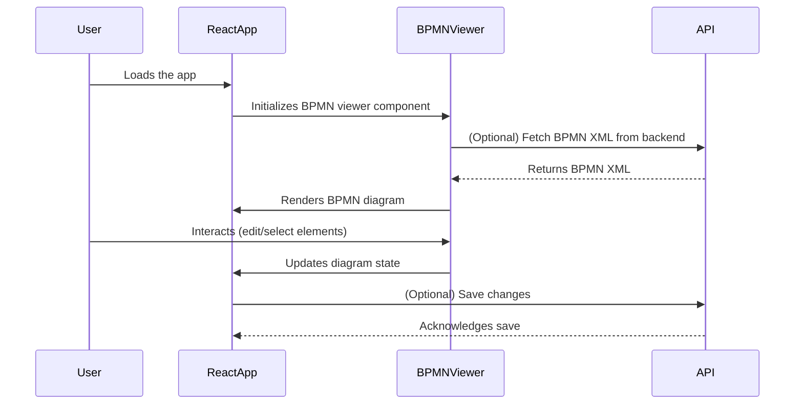

# bpmn-generator-ui

A React-based frontend for BPMN diagram visualization and editing, leveraging `bpmn-js` and related libraries. This UI allows users to view, edit, and interact with BPMN diagrams, supporting professional features and property panels.

## Table of Contents

- [Project Overview](#project-overview)
- [Features](#features)
- [Project Structure](#project-structure)
- [Sequence Diagram](#sequence-diagram)
- [Setup & Installation](#setup--installation)
- [Usage](#usage)
- [Dependencies](#dependencies)
- [Docker Support](#docker-support)
- [Development](#development)
- [License](#license)

---

## Project Overview

`bpmn-generator-ui` is a single-page application built with React for visualizing and editing BPMN diagrams. It integrates with BPMN libraries to provide a rich user experience for business process modeling.

## Features

- BPMN diagram rendering and editing
- Property panel for BPMN elements
- Styled components for custom UI
- REST API integration via Axios
- Dockerized for easy deployment

## Project Structure

```
bpmn-generator-ui/
│
├── Dockerfile
├── package.json
├── README.md
├── render.yaml
├── public/
│   ├── favicon.ico
│   └── index.html
└── src/
		├── App.js
		├── index.js
		└── components/
				├── BpmnVisualization.js
				├── ProfessionalBpmnViewer.css
				└── ProfessionalBpmnViewer.js
```

- **Dockerfile**: Containerizes the React app for deployment.
- **package.json**: Project metadata and dependencies.
- **public/**: Static assets and HTML template.
- **src/**: Source code.
	- **App.js**: Main React component.
	- **index.js**: Entry point for React.
	- **components/**: Reusable UI components for BPMN visualization.

## Sequence Diagram

Below is a simplified sequence diagram for the BPMN diagram loading and editing flow:



## Setup & Installation

### Prerequisites

- Node.js (v16+ recommended)
- npm

### Local Development

```sh
npm install
npm start
```

App runs at `http://localhost:3000`.

### Docker

Build and run the app in a container:

```sh
docker build -t bpmn-generator-ui .
docker run -p 3000:3000 bpmn-generator-ui
```

## Usage

- Open the app in your browser.
- Load or create BPMN diagrams.
- Edit elements and view properties.
- Save or export diagrams as needed.

## Dependencies

Key libraries:

- `react`, `react-dom`: UI framework
- `bpmn-js`, `bpmn-js-properties-panel`: BPMN rendering and editing
- `diagram-js`: Diagram toolkit
- `axios`: HTTP requests
- `styled-components`: CSS-in-JS styling
- `ajv`, `ajv-keywords`: JSON schema validation

## Development

- Edit components in `src/components/` for custom BPMN features.
- Update `App.js` for main logic.
- Use Docker for consistent deployment.

## License

This project is private. For licensing details, contact the repository owner.
